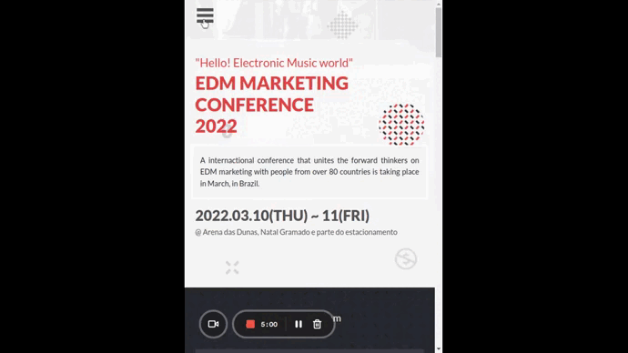
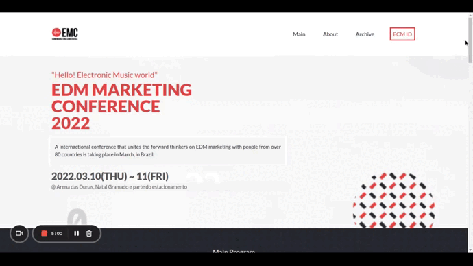

# 2022's EDM Marketing Conference (EMC Natal 2022)
> This project is intended to show EMC 2022's attendees all information related to the EMC 2022.
> The Electronic Dance Music Marketing Conference gathers electronic music and event producers from all around the world since 1992. This year, it will be held in Natal, Brazil.
> This web page was made with Ubuntu 20.04 + VS Code 1.64.2 + a lot of imagination and hard work.
> Teamwork was also an essential tool to make things happen, so thank you to all my coding partners who worked with me so far.

## Built with
- HTML
- CSS
- JavaScript

## Live Demo
- Live version: [mrjuda.github.io/jt-m1-capstone](https://mrjuda.github.io/jt-m1-capstone)

- Mobile version:
> 
- Desktop version:
> 

## Authors
**Judá F Teixeira**
- GitHub: [@mrjuda](https://github.com/mrjuda "Judá Teixeira's GitHub profile")
- LinkedIn: [@judateixeira](https://www.linkedin.com/in/judateixeira "Judá Teixeira's Linkedin profile")

## Contributing
**Emily Robertson**
- GitHub: [@emyrue](https://github.com/emyrue "Emily Robertson's GitHub profile")
- Twitter: [@EmyRueRobertson](https://twitter.com/EmyrueRobertson "Emily Robertson's Twitter profile")
- LinkedIn: [@emily-robertson-70a2bb22a](https://www.linkedin.com/in/emily-robertson-70a2bb22a/ "Emily Robertson's LinkedIn profile")

**Selase**
- GitHub: [@dewslyse](https://github.com/dewslyse "Selase's GitHub profile")

## Acknowledgments
**Cindy Shin (Original author)**
- Bèhance: [@adagio07](https://www.behance.net/adagio07 "Cindy Shin's Bèhance's profile")
- LinkedIn: [@adagio07](https://www.linkedin.com/in/adagio07 "Kiju Shin's LinkedIn profile")
- Dribbble: [@adagio07](https://dribbble.com/adagio07/collections "Cindy Shin' Dribble profile")

## 📝License
This project is [MIT](https://github.com/mrjuda/jt-m1-capstone/blob/main/LICENSE) licensed.